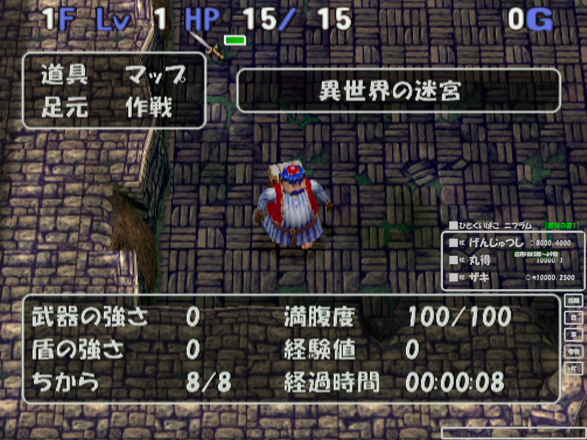

## Overview / 概要

This is a web-based item checklist tool used in Toruneko's Great Adventure 3 [Labyrinth of Another World], which allows you to manage items and save their state. It runs locally and can be easily distributed. Furthermore, it is designed to serve as a gadget for use with streaming tools such as OBS. Capture it as a window capture in the bottom-right corner of your game screen, and by using color keying or chroma keying on the background, you can make the background transparent.

トルネコの大冒険3【異世界の迷宮】にて、アイテムの一覧を管理し、 
その状態を保存できるウェブベースのチェックリストツールです。 
ローカルのブラウザ環境で動作します。 
さらに、OBSなど配信ツールでの利用を想定したガジェットとしても利用できるよう設計されています。 
ゲーム画面の右下にウィンドウキャプチャとして取り込み、 
背景色をカラーキーやクロマキーとして利用することで背景を透過させることが可能です。 

本ツールは、配信や広告収入などの商業利用を含むあらゆる用途で、 
特別な許諾なくご利用いただけます。 
ただし、原著作者は私「じぇいつぅ」であることをご理解いただき、 
ツールのご利用にあたって、あたかもご自身が開発されたかのような 
虚偽の表現をなさることはご遠慮くださいますようお願い申し上げます。 
もし可能であれば、下記のクレジット表示をしていただけると大変ありがたく存じます。 
 
じぇいつぅるず「T3DB」 
X: @iidx_j2 
 
## Features / 特徴

- **Dynamic Item Display:** Items are generated dynamically from embedded CSV data.
- **State Saving:** The state is saved using your browser’s localStorage.
- **Customizable Colors:** Adjust colors via a dedicated settings panel.
- **Search Functionality:** Search and highlight matching items.
- **Multiple Lists:** Manage different “adventure books” (separate item sets).
- **Font Options:** Two versions are available (default and Meiryo) for optimal font rendering.

- **動的なアイテム表示:** 埋め込みのCSVデータからアイテムを動的に生成。
- **状態の保存:** ブラウザの localStorage を使用して状態を保存。
- **カラー設定:** 専用の設定パネルで色をカスタマイズ可能。
- **検索機能:** アイテムの検索およびハイライト表示。
- **複数リスト:** 異なる「冒険の書」による状態管理が可能。
- **フォント対応:** デフォルト版とメイリオ版（index.html と indexmeiryo.html）を用意。

## How to Use / 利用方法

1. **Clone or Download:**  
   Clone the repository or download the ZIP file.

   リポジトリをクローンするか、ZIPファイルをダウンロードしてください。

2. **Open in Browser:**  
   We have confirmed the application works on Google Chrome.  
   - If your environment has the **HGP創英角ﾎﾟｯﾌﾟ体** font installed, open `index.html`.  
   - Otherwise, open `indexmeiryo.html`.

   Google Chrome で動作確認を行っています。  
   - お使いの環境に **HGP創英角ﾎﾟｯﾌﾟ体** フォントがインストールされている場合は、`index.html` を開いてください。   
   それ以外の場合は、`indexmeiryo.html` を開いてください。  
   
   The layout is designed to remain intact in either case.
   どちらの場合でもレイアウトは崩れないようになっています。

3. **Interact:**  
   The application will load the item list. Check items, use the search box, and adjust color settings as needed. Your changes are saved automatically.

   アプリケーションがアイテムリストを読み込みます。アイテムのチェックや検索、カラー設定の調整を行ってください。変更内容は自動的に保存されます。

## Installation / インストール

Since this is a static web application, no installation is necessary. Simply open the HTML file in your browser.

これは静的なウェブアプリケーションのため、インストールは不要です。HTMLファイルをブラウザで開くだけで動作します。

## Contributing / 貢献

If you have suggestions or improvements, please feel free to fork the repository and submit a pull request.

改善案やご意見があれば、リポジトリをフォークしてプルリクエストを送ってください。

## License / ライセンス

This project is licensed under the MIT License.

本プロジェクトは MIT ライセンスの下で公開されています.

